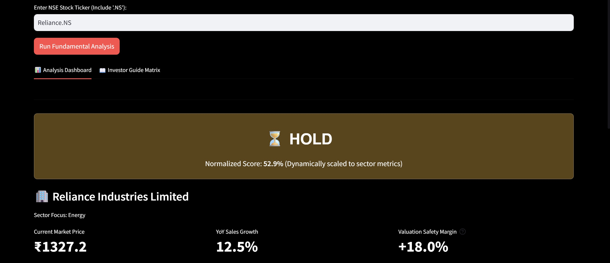

# 📊 Long-Term Indian Stock Screener (Vibe-Coded)

An automated fundamental analysis dashboard engineered to pull live data from the National Stock Exchange (NSE) and evaluate companies against long-term value investing frameworks. Built entirely in Python using Streamlit, yfinance, and Altair.

## 🚀 Live Link
👉 **[View the Deployed Web Application on Streamlit Cloud](https://share.streamlit.io/)** *(Replace this link with your actual Streamlit deployment URL once live)*

---

## 🎯 Key Features
* **Automated Scoring Engine:** Processes key fundamental metrics dynamically, scoring companies out of a relative maximum scaling baseline.
* **Context-Aware Evaluation:** Dynamically adjusts rules based on industry sectors. For instance, Price-to-Book (P/B) is calculated exclusively for asset-heavy segments (Financials, Industrials), while banks are automatically exempt from traditional Debt-to-Equity penalties.
* **Interactive Data Matrix:** Clear dark-mode scorecards itemizing individual rating zones (Good 🟢, Normal 🟡, Bad 🔴).
* **Real-Time Price Charting:** High-contrast 1-year price charts running on an auto-scaled Altair engine.
* **Valuation Safety Buffer:** Live monitoring of current P/E deviations against structural historical averages.

---

## 🛠️ The Scoring Framework

The application grades tickers based on a customized long-term investment matrix. Switch to the **Investor Guide Matrix** tab within the live app or see the baseline configuration criteria below:

| Metric Framework | Good (Buy Zone) | Normal (Fair Value) | Bad (Avoid / High Risk) |
| :--- | :--- | :--- | :--- |
| **P/E Ratio** | 10 - 18 | 18 - 30 | > 45 or < 8 (Value Trap) |
| **PEG Ratio** | < 1.0 (Underpriced) | 1.0 - 1.5 | > 1.5 |
| **ROE** | > 18% | 13% - 17% | < 12% |
| **ROCE** | > 20% | 13% - 19% | < 12% |
| **Debt-to-Equity** | < 0.5 | 0.5 - 1.0 | > 1.2 |
| **Current Ratio** | > 1.5 | 1.1 - 1.5 | < 1.0 (Liquidity Risk) |

---

## 🖥️ Preview & Interface
Here is a snapshot of the live data scorecard in action:



---

## 📦 Local Installation & Setup

If you wish to clone this repository and run the engine locally on your machine, follow these steps:

1. **Clone the repository:**
   ```bash
   git clone [https://github.com/yourusername/stock-screener.git](https://github.com/yourusername/stock-screener.git)
   cd stock-screener
   ```

2. **Install the dependencies:**
   Make sure you have Python installed, then run:
   ```bash
   pip install -r requirements.txt
   ```

3. **Launch the local Streamlit environment:**
   ```bash
   streamlit run app.py
   ```

---

## 📄 License
This project is open-source software licensed under the terms of the [MIT License](LICENSE).

## ⚠️ SEBI Legal Disclaimer
**IMPORTANT:** The author of this software is **not** a SEBI-registered investment advisor or research analyst. This platform processes fundamental formulas strictly for educational assessment and algorithmic tracking simulation logic. Automated outputs and ranking tags do not represent formal investment advice or trade solicitations.

For full terms of use and liability limitations, please review the standalone compliance page: **[DISCLAIMER.md](DISCLAIMER.md)**.
